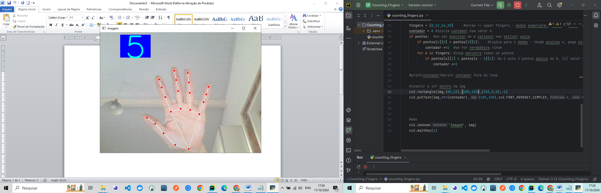
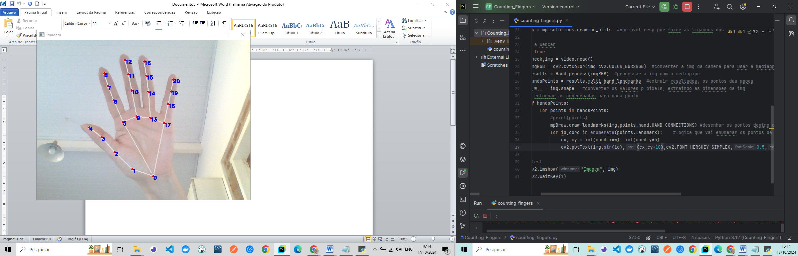
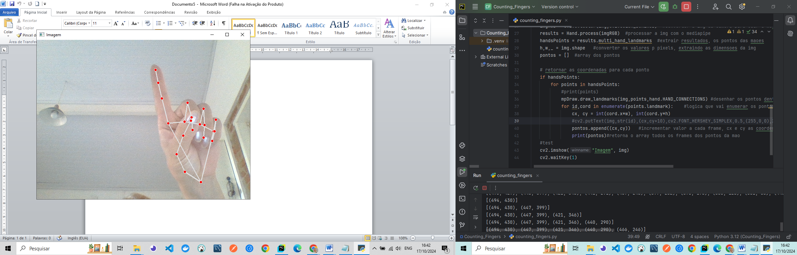

<h2 align="center"> 💻 Counting_Fingers_mediapipe_PY </h2>
<br>

<h4 align="center"> 💻  This project demonstrates how to use OpenCV and Mediapipe to detect and track hand movements using a webcam. The solution captures landmarks of a hand, processes them to identify if fingers are open or closed, and displays the count on the video feed. </h4>
<br>

---
## Counting_Fingers_mediapipe_PY

- The project uses **Mediapipe**'s `Hands` solution to detect hand landmarks and **OpenCV** to handle video capture and display. This implementation focuses on detecting whether fingers are open or closed and counts the number of open fingers. The count is then displayed in real-time on the video feed.

---

<h4 align="center">Counting_Fingers_mediapipe_PY 🚀</h4>

<div align="center">
    
    
</div>

<br />
<br />

<div align="center">
    
    
</div>

---

## Key Libraries
- **OpenCV**: Handles video capture and image processing.
- **Mediapipe**: Provides hand landmark detection and tracking capabilities.

---

## Code Explanation

1. **Suppressing Warnings**:

- We start by suppressing unnecessary warnings from TensorFlow Lite and `protobuf`, which are used internally by Mediapipe.
```python
   os.environ['TF_CPP_MIN_LOG_LEVEL'] = '3'
   warnings.filterwarnings("ignore", category=UserWarning, module='google.protobuf')
```

2.	Setting up Video Capture: We initialize OpenCV's VideoCapture to access the webcam.

 ```python
   video = cv2.VideoCapture(0)
 ```

3.	Initializing Mediapipe's Hand Tracking: We create an instance of Mediapipe's Hands solution, which will be used to detect hand landmarks. We're limiting the detection to one hand in this example.

 ```python
  hand = mp.solutions.hands
  Hand = hand.Hands(max_num_hands=1)
  mpDraw = mp.solutions.drawing_utils
  ```

4.	Processing the Video Feed: In the main loop, we read each frame from the webcam, convert it to RGB format (required by Mediapipe), and process it to extract hand landmarks.
   
```python
   check, img = video.read()
  imgRGB = cv2.cvtColor(img, cv2.COLOR_BGR2RGB)
  results = Hand.process(imgRGB)
  handsPoints = results.multi_hand_landmarks
 ```

5.	Drawing Hand Landmarks: If hand landmarks are detected, we draw them on the frame using mpDraw.draw_landmarks.


 ```python
   if handsPoints:
    for points in handsPoints:
        mpDraw.draw_landmarks(img, points, hand.HAND_CONNECTIONS)

 ```

6.	Counting Open Fingers: We use the landmarks to identify if the fingers are open or closed. The code handles the thumb differently from the other four fingers.

 ```python
   fingers = [8, 12, 16, 20]
  contador = 0
  if pontos[4][0] < pontos[2][0]:
    contador += 1
  for x in fingers:
    if pontos[x][1] < pontos[x - 2][1]:
        contador += 1
 ```

7.	Displaying the Count on the Frame: We add a rectangle and text to the frame to display the number of open fingers.

 ```python
   cv2.rectangle(img, (80, 10), (200, 100), (255, 0, 0), -1)
  cv2.putText(img, str(contador), (100, 100), cv2.FONT_HERSHEY_SIMPLEX, 4, (255,       255, 0), 5)

 ```

8.	Displaying the Output: Finally, we display the frame with the hand landmarks and finger count using OpenCV's imshow.

 ```python
   cv2.imshow("Imagem", img)
   cv2.waitKey(1)
 ```

## How It Works
-	The Mediapipe library detects 21 landmarks on the hand.
- We use a simple logic to check if certain points (fingertips) are above or below other points (knuckles) to determine if a finger is open or closed.
- The count of open fingers is displayed on the video feed in real-time.

---

## Dependencies

-	OpenCV
-	Mediapipe

You can install these dependencies using the following commands:
 ```python
    pip install opencv-python
    pip install mediapipe
 ```

---

## How to Run the Project
1.	Clone the repository or download the code.
2.	Install the dependencies.
3.	Run the Python script, and the webcam feed will open with real-time hand detection and finger counting.
 ```python
    python hand_detection.py
 ```
---

## License
- This project is licensed under the MIT License.
---


### 📦 Contribution

 - Feel free to contribute by submitting pull requests or reporting issues.

- #### My LinkedIn - [](https://www.linkedin.com/in/lucianadiemert/)

#### Contact


#### [**Luciana Diemert**](https://github.com/ludiemert)

🛠 Full-Stack Developer <br>
🖥️ Python Enthusiast | Computer Vision | AI Integrations <br>
📍 São Jose dos Campos – SP, Brazil

<a href="https://www.linkedin.com/in/lucianadiemert" target="_blank"></a>&nbsp;
<a href="mailto:lucianadiemert@gmail.com" target="_blank"></a>&nbsp;
<a href="#"></a>&nbsp;
<a href="https://www.github.com/ludiemert" target="_blank"></a>&nbsp;

<br clear="left"/>
